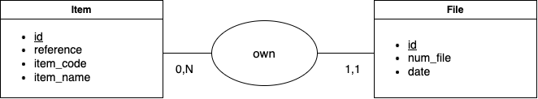

<a name="readme-top"></a>


<!-- PROJECT LOGO -->
<br />
<div align="center">
  <a href="https://github.com/Destroyeur6315/api_flask">
    
  </a>

  <h3 align="center">API RESTful</h3>

  <p align="center">
    A little project for learn flask. It's a API which respect REST methodology.
  </p>
</div>


## Built With

* Language : Python
* Framework : Flask
* Unit test : pytest
* Technical document : swagger 
* User document : README.md
* Database : SQLite

## About the project

Here is the subject : 
> Design a RESTful API with the appropriate endpoints to populate and consult the database. Endpoints must include at least create, read, update, and delete (CRUD) functionality.

If you want to start the project, go to section *Getting started*.

So, the api have 12 endpoints for populate and consult the databse. The database have only 2 tables : item and file. Here you can watch the MCD :

<br>

<div class="text-center">
    
</div>

<br>

There are two .csv (data_file and data_item) in the folder *data* which allows to put data in the database. 

<!-- GETTING STARTED -->
## Getting Started


### Prerequisites

For launch this projet on your computer, you might have npm. If you don't have, install with the command :
```sh
npm install npm@latest -g
```

### Installation

1. Clone the repo
   ```sh
   git clone https://github.com/Destroyeur6315/api_flask.git
   ```
2. Change directory
   ```sh
   cd api_v1
   ```
3. Create an virtual environnement
   ```sh
   python -m venv .venv
   ```
4. Actiavte the virtual environnement
   ```sh
   . .venv/bin/activate
   ```
5. Install dependancies
   ```sh
   pip install -r requirements.txt
   ```
6. Run the file *setup_db* for create the database and insert data :
   ```sh
   python db/setup_db.py
   ```
7. Run the API:
   ```sh
   python api.py
   ```

<p align="right">(<a href="#readme-top">back to top</a>)</p>


<!-- USAGE EXAMPLES -->
## Usage

You can use API with diffent support to test endpoints, like postman, in your shell (with curl command) or directly in your best browser.
But I recommend you to use swagger. 

For see the swagger documentation go to : http://127.0.0.1:5000/api/docs/

Remark: Your api have to be run for see the swagger doc.

## Test

I use pytest for Unit test.

You just have to enter the command on your shell in the root of the project:
```sh
   pytest -vs
```

Remark: you just to have put pytest without give files because pytest look over all your project and see if file begin with *test_ANYTHING.py*  and in these files, if function begin with the same thing (def test_....(): ...), it launch the function. The option *v* and *s* allow to have more information. You can don't put them.

<!-- LICENSE -->
## License

Distributed under the MIT License. See `LICENSE.txt` for more information.

<p align="right">(<a href="#readme-top">back to top</a>)</p>


<!-- ACKNOWLEDGMENTS -->
## Acknowledgments

This list contain all things that helped me to developped my api

* [Flask documentation](https://flask.palletsprojects.com/en/3.0.x/quickstart/)
* [Web site which explain how developped an API REST with flask](https://programminghistorian.org/en/lessons/creating-apis-with-python-and-flask#overview)
* [ChatGPT](https://chat.openai.com)
* [Youtube video for understand pytest](https://www.youtube.com/watch?v=7dgQRVqF1N0&t=1913s)
* [Youtube video for understand swagger](https://www.youtube.com/watch?v=ayn-I9sV7BU)
* [Youtuve video for understand SQLite](https://www.youtube.com/watch?v=m9hUC-WRclU)
<p align="right">(<a href="#readme-top">back to top</a>)</p>
