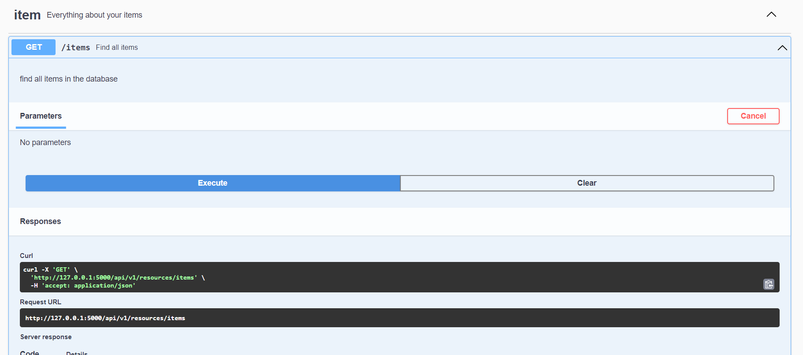

<a name="readme-top"></a>


<!-- PROJECT LOGO -->
<br />
<div align="center">
  <a href="https://github.com/Destroyeur6315/api_flask">
    
  </a>

  <h3 align="center">API RESTful</h3>

  <p align="center">
    A little project for learn flask. It's an API which respects REST methodology.
  </p>
</div>


## Built With

* Language : Python
* Framework : Flask
* Unit test : pytest
* Technical document : swagger 
* User document : README.md
* Database : SQLite

## About the project

Here is the subject : 
> Design a RESTful API with the appropriate endpoints to feed and consult the database. Endpoints must include at least create, read, update, and delete (CRUD) functionalities.

If you want to start the project, go to section *Getting started*.

So, the api has 12 endpoints to feed and consult the databse. The database has only 2 tables: Item and File. As ilustrated in the screenshot of the MCD:

<br>

<div class="text-center">
    
</div>

<br>

There are two .csv (data_file and data_item) in the folder *data* which allows to add data in the database. 

<!-- GETTING STARTED -->
## Getting Started


### Prerequisites

To launch this API on your computer, you need to have npm and python 3.*. If not, install with the following command:
```sh
npm install npm@latest -g
```

For python, download the executable : https://www.python.org/downloads/

### Installation

1. Clone the repo
   ```sh
   git clone https://github.com/Destroyeur6315/api_flask.git
   ```
2. Change directory
   ```sh
   cd api_flask/api_v1
   ```
3. Create a virtual environment 
   1. On MacOS/Linux
   ```sh
   python -m venv .venv
   ```
   2. On Windows
   ```sh
   py -3 -m venv .venv
   ```
4. Activate the virtual environment 
   1. On MacOS/Linux
   ```sh
   . .venv/bin/activate
   ```
    2. On Windows
   ```sh
   .\.venv\Scripts\activate
   ```
5. Install dependancies
   ```sh
   pip install -r requirements.txt
   ```
6. Run the file *setup_db* to create the database and to insert data:
   ```sh
   python db/setup_db.py
   ```

<br>

<div class="text-center">
    
</div>

<br>


7. Run the API:
   ```sh
   python api.py
   ```

<p align="right">(<a href="#readme-top">back to top</a>)</p>


<!-- USAGE EXAMPLES -->
## Usage

You can use API with diffent supports to test endpoints but I would recomend using swagger. You may use other supports like postman, in your shell (with curl command) or directly in your favorite browser.

To see the swagger documentation go to: http://127.0.0.1:5000/api/docs/

Comment: your api has to run to see the swagger doc.

Here is an example on how to use swagger:

1. When you are at *http://127.0.0.1:5000/api/docs/*, you scroll a little and you can see severals endpoints:

<br>

<div class="text-center">
    
</div>

<br>

2. If you want to test the first endpoint */items*, you can click on the endpoint. You should see the following on your screen:

<br>

<div class="text-center">
    
</div>

<br>

3. To send the HTTP request, you have to click on **Try it out** and a blue button with the word **Execute** will appear. Click on it :

<br>

<div class="text-center">
    
</div>

<br>

4. To see the response, scroll until the "Server response"'s section. The response is in JSON:

<br>

<div class="text-center">
    
</div>

<br>


## Test

I use pytest for Unit test.

You just have to enter the command on your shell (you have to be in api_v1 repository) :
```sh
   pytest -vs
```

Comment: you just have to put pytest without naming the files. You can to do this, because pytest looks over all of your projects and finds the files that begin with *test_ANYTHING.py*. In these files, if a function begins with "test_..." it launches the function. The options *v* and *s* allow to have more information. You don't necessarily need to use those options.

Normally, after run the command *pytest -vs* you should see :

<br>

<div class="text-center">
    
</div>

<br>

<!-- LICENSE -->
## License

Distributed under the MIT License. See `LICENSE.txt` for more information.

<p align="right">(<a href="#readme-top">back to top</a>)</p>


<!-- ACKNOWLEDGMENTS -->
## Acknowledgments

This list contains all the things that helped me to developped my API:

* [Flask documentation](https://flask.palletsprojects.com/en/3.0.x/quickstart/)
* [Web site which explain how developped an API REST with flask](https://programminghistorian.org/en/lessons/creating-apis-with-python-and-flask#overview)
* [ChatGPT](https://chat.openai.com)
* [Youtube video for understand pytest](https://www.youtube.com/watch?v=7dgQRVqF1N0&t=1913s)
* [Youtube video for understand swagger](https://www.youtube.com/watch?v=ayn-I9sV7BU)
* [Youtuve video for understand SQLite](https://www.youtube.com/watch?v=m9hUC-WRclU)
<p align="right">(<a href="#readme-top">back to top</a>)</p>
